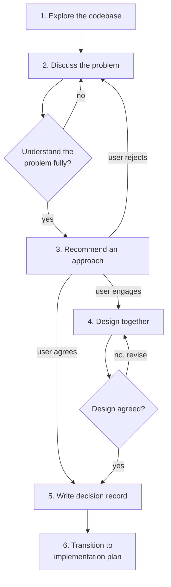

# Brainstorming

## Overview

Turn ideas into fully formed designs through collaborative dialogue.

This is a pairing process, not a presentation. The user always has context you don't — experience, constraints, opinions, things they've tried before. Reading the codebase gives you a picture of what exists, but never the full picture of what should change or why. Your understanding is incomplete until you've had the discussion.

**This skill IS the planning process.** Do NOT use built-in plan mode, `EnterPlanMode`, or any agent planning mechanism. This skill defines how exploration and design discussion works — follow it directly.

## When to Use

**Always before:**
- New features
- Behaviour changes
- Non-trivial additions
- Architectural changes
- New components or modules

**Exceptions (ask the user):**
- Trivial bug fixes with obvious scope
- Single-line changes
- Generated code
- Pure configuration

"This is too simple to need a design" is not an exception. Simple features are where unexamined assumptions waste the most time. The design can be short, but it must exist and be approved.

## Re-Invocation

This skill may be called with an existing brainstorming document when a later stage (typically the implementation plan skill) discovers a genuine design gap.

When re-invoked:
- Read the existing document first
- Understand what gap needs addressing
- Skip the full exploration — focus on the specific gap
- Ask the relevant questions
- Update the existing document (see [Document Integrity](#document-integrity))
- Do not rewrite or restructure unaffected sections

## The Process

### 1. Explore the Codebase

Read relevant files, docs, and recent commits. Understand the current state.

You will notice things during this phase — potential approaches, patterns, problems. That's fine. But recognise that these observations are formed without the user's input. They are starting points for questions, not conclusions.

Use nudge tools to anchor observations to code when useful:
- `note` to mark places in the codebase that will be affected by the feature
- `look_at_this` to draw the user's attention to existing patterns relevant to the discussion
- `question` to ask about specific code, anchored to the actual definition

These are not mandatory — use them when pointing at code in the editor is clearer than describing it in chat. Sometimes the discussion is purely conceptual and code anchoring does not help.

### 2. Discuss the Problem

This is the most important phase. The goal is to understand what the user wants and why — not to validate an approach you've already formed.

**Ask about the problem, not about solutions.** Questions should explore purpose, constraints, success criteria, past experience, and edge cases. They should not present options or steer toward an approach.

Good questions:
- "What's the actual pain point this solves?"
- "How do you expect to interact with this day to day?"
- "Is there anything you've tried before that didn't work?"
- "What would make this not worth doing?"

Bad questions (these are solution-space questions — some belong in the implementation plan, not brainstorming at all):
- "Should we use approach A or approach B?"
- "Would you prefer polling or webhooks?"
- "I see three options — which appeals to you?"

One question per message. Do not overwhelm with multiple questions.

- Prefer multiple choice when the question is genuinely about the problem (e.g. "Is this for local use only, remote, or both?")
- Open-ended is fine and often better in this phase — you're exploring, not narrowing
- If a topic needs more exploration, break it into multiple questions

Keep discussing until you genuinely understand what is being built, why it matters, and what constraints shape it. The test is not "can I propose a solution?" — you could do that before asking any questions. The test is "do I understand the problem well enough that my recommendation will be informed by the user's actual needs?"

### 3. Recommend an Approach

Form a single recommendation based on what you learned from both the codebase and the discussion. Present it and explain your reasoning.

- One approach, not three. Do not manufacture alternatives for the sake of balance.
- Explain why this approach fits what you learned in the discussion. Connect it to specific things the user said.
- Be honest about trade-offs and downsides.
- Keep it conversational — a paragraph or two, not a formal proposal.

Where there are obvious alternative architectural directions — approaches that would fundamentally change the shape of the solution — address them briefly in your reasoning. Not as separate options to choose between, but as part of explaining why you chose what you chose. "I'd go with pull here because X — push would also work but Y makes it a weaker fit" is a single recommendation with visible reasoning, not three options. This lets the user see your thinking and engage with specific points ("actually Y doesn't apply here because...") rather than asking "why not push?" as a follow-up.

The test is: would this alternative produce a different design document, or just a different implementation of the same design? Push vs pull would change the design — mention it. Polling vs webhooks are both implementations of pull — that's an implementation plan decision, not a brainstorming one.

**If the user agrees with the recommendation** and doesn't need to work through details — move to step 5 and write the decision record. Not every design needs a detailed walkthrough. If the recommendation is well-reasoned and the user is satisfied, writing it up is the next step.

**If the user engages with the recommendation** — asks questions, suggests modifications, pushes back on parts — move into step 4 and design together.

**If the user rejects the recommendation outright** — they have a different idea, or the recommendation missed something fundamental — go back to step 2. The rejection likely means there's context you still don't have. Ask about it rather than immediately proposing a second idea.

### 4. Design Together

Work through the design collaboratively. This is where the details get worked out.

- Present the design incrementally, section by section
- Scale each section to its complexity: a few sentences if straightforward, more detail if nuanced
- Ask after each section whether it looks right so far
- Be ready to revise when something doesn't make sense

**This is a collaborative conversation, not a document review.** The user may push back, suggest changes, raise concerns, or propose alternatives to specific parts. Engage with these — defend your reasoning when you think you're right, concede when the user raises a valid point, and suggest alternatives when part of the design isn't working.

If the user challenges a design decision:
- Engage with the substance of their concern
- If you think the original decision is correct, explain why — don't just defer
- If their concern reveals context you didn't have, acknowledge it and adapt
- If they contradict something established earlier in the discussion, point that out constructively

Alternatives surface organically here. When discussing a specific aspect, you might say "we could also do X here, but I think Y is better because..." — this is natural and useful. What you should not do is present a pre-prepared set of options for each decision point.

### 5. Write the Decision Record

**Do not write the decision record until the user has explicitly approved the design.** If the design was worked through in step 4, the user saying "that section looks fine" during the conversation is not blanket approval — the full design must be agreed before writing the document. If step 4 was skipped because the user agreed with the recommendation directly, their agreement is the approval.

Write the output document. See [Output Document](#output-document) for the structure.

Save to: `YYYY-MM-DD-<topic>-design.md` in the project root.

Do not commit it. The user will handle that.

### 6. Transition

The brainstorming skill's job is done. The next step is the implementation plan skill, invoked in a new context.

The decision record must be complete enough that a fresh agent with no memory of this conversation can read it and the codebase and produce an implementation plan. This is the test of whether the document is good enough — if a key decision or constraint only exists in chat history, it is not in the document and needs to be.

## Output Document

The decision record has these sections. Include all of them, but scale each to its complexity — some may be a single sentence for simple features.

### Goal

One or two sentences. What the feature does and why it exists.

### Constraints

Things that came up during discussion that shape the design. Performance requirements, compatibility needs, existing patterns to follow, dependencies.

If nothing notable, say so briefly rather than omitting the section.

### Alternatives Considered

Alternatives that came up organically during the design discussion, with reasoning for why they were not chosen. This section answers "why this way and not another?" for future readers.

If the design was straightforward and no real alternatives were discussed, say so. Do not retrospectively invent alternatives to fill this section.

### Design

The chosen approach in enough detail to implement from. Components, data flow, error handling, whatever is relevant. This is not a spec — it describes intent and structure, not exact code.

### Out of Scope

Things explicitly excluded from this feature. This section is a guard rail for later stages — if something appears here, the implementation plan and TDD skills should not include it.

Be specific. "Performance optimisation" is vague. "Connection pooling for the HTTP client" is actionable.

### Implementation Notes

Things the brainstorming surfaced that the implementation plan skill needs to know. Existing code patterns to follow, known edge cases, areas of the codebase that will be affected, relevant decisions about approach.

This is the bridge to the next skill. If nothing noteworthy came up, the section can be short or absent.

## Document Integrity

The decision record must always read as a coherent document, regardless of how many times it has been edited.

- Updates go into the correct section, not appended to the end
- If a constraint is discovered later, it goes in Constraints
- If an out of scope item turns out to be in scope, it moves
- No "addendum" or "update" sections
- No edit history visible in the document
- The document should look like it was written in one pass

## Collaboration

This skill is a pairing exercise. The dynamic should be two people working through a problem together, not an assistant presenting options for approval.

**Have opinions and defend them.** When you think the user is heading in a direction that will cause problems, say so. Explain your reasoning. Don't just defer because they're the user — they want a collaborator, not a yes-machine.

**Concede when you're wrong.** If the user raises a point that genuinely changes the picture, acknowledge it. Don't cling to your position for the sake of consistency. "That's a good point, I hadn't considered X" is a perfectly fine response.

**Point out contradictions constructively.** If the user says something that conflicts with what they said earlier, raise it. "Earlier you mentioned X, but this seems to pull in the other direction — which matters more?" is helpful. Silently accommodating contradictions produces incoherent designs.

**Connect your reasoning to the discussion.** When you recommend something or defend a position, reference what the user told you. "Based on what you said about wanting this to be low-maintenance..." shows you're building on the conversation, not reciting predetermined conclusions.

## Key Principles

- **One question at a time** — do not overwhelm
- **Problem before solution** — understand what and why before proposing how
- **Single recommendation** — one informed approach, not three manufactured options
- **Collaborative design** — work through details together, defend and concede honestly
- **YAGNI** — remove unnecessary features from designs
- **Incremental validation** — present design, get agreement, then move on
- **No implementation** — this skill produces a design, not code
- **Nudge tools are optional** — use them when anchoring to code helps, skip when discussion is conceptual
