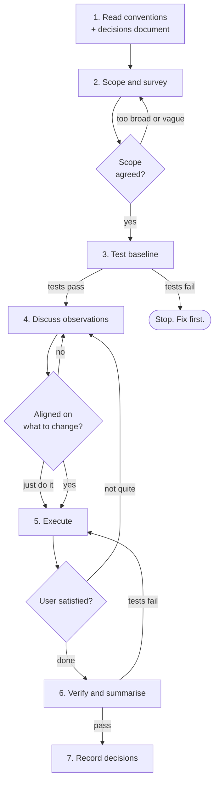

# Go Refactor

If you see `CLAUDE.md`, you can assume it has the same content as `AGENTS.md`.

## Overview

Take working Go code and make it clean. Better structure, better names, better flow, better file layout. The kind of code you open and think "I know exactly where everything is" rather than "I suppose this works."

This is a collaborative assessment. The agent brings knowledge of Go idioms and structural patterns. The user brings context and taste — why things are the way they are, what matters most, what feels right. Neither perspective alone produces a good refactoring.

This skill does not add features, add tests, or change what the code does. It changes how the code is organised, read, and maintained.

**This skill does NOT use built-in plan mode or any agent planning mechanism.** It follows the process defined here.

## When to Use

- Code that works but feels rough — too much in one file, unclear names, tangled control flow
- After a feature lands and the dust settles — things got shuffled around during development
- Code written without the team's conventions
- Packages that have grown organically and need restructuring
- Code that a new team member would struggle to navigate

## When NOT to Use

- Code that does not work yet (fix it first)
- Code that needs new functionality (use the brainstorming/implementation-plan/TDD pipeline)
- Code that needs tests added (use the TDD skill)
- Single-line tweaks or formatting fixes (`gofmt` and `golangci-lint` handle that)
- Performance optimisation (that changes behaviour characteristics)

"This code is ugly but works" is exactly when to use this skill. "This code is ugly and broken" is not — fix it first, then refine.

## The Constraint

```
BEHAVIOUR DOES NOT CHANGE
```

Every test that passed before must pass after. Every exported identifier that existed before must exist after — same names, same signatures, same semantics. If a caller cannot tell the difference, the refactor is correct. If a caller can tell, something went wrong.

This is the constraint that makes refactoring safe. Without it, you are not refactoring — you are rewriting.

## The Process



### 1. Read Project Conventions

Read the project's CLAUDE.md and any AGENTS.md files.

If `refactor-decisions.md` exists at the repo root, read it — it captures taste preferences from previous sessions. See [The Decisions Document](#the-decisions-document).

The convention hierarchy, highest priority first:

1. **CLAUDE.md / AGENTS.md** — the team's explicit rules. Non-negotiable.
2. **refactor-decisions.md** — recorded taste preferences from previous sessions.
3. **Consistent patterns in the codebase** — if the code consistently does something, follow it. Consistency matters more than any individual opinion.
4. **Standard Go idioms** — Effective Go, the Go proverbs, widely accepted community patterns.
5. **Agent preference** — irrelevant. Do not impose opinions not grounded in the layers above.

If CLAUDE.md says one thing and the codebase consistently does another, ask the user.

### 2. Scope and Survey

This step finds the boundary of the work. The user may know exactly what to look at, or they may not — the process handles either.

#### When the user has a clear target

They say "look at the retry package" or "this file is a mess." Read the target code. Proceed to step 3.

#### When the user is vague

"It just doesn't feel right" is real feedback — the user knows something is off but cannot point at it yet. They need something concrete to react to, not a request to be more specific.

Do a quick broad survey — package structure, file sizes, naming, a few representative files. Come back with observations, not proposals:

**"I looked at the codebase and three things stand out:**
1. **The config package has five types in one file with no clear grouping**
2. **Error handling is inconsistent — some functions wrap, some don't, some use sentinels**
3. **The handler functions nest 4-5 levels deep**

**Which of these resonates? Or is it something else?"**

The user will react:
- "1 and 3" — scope to those areas, tackle one at a time
- "None of those — it's the way the types are defined" — look at types specifically
- "All of them" — suggest starting with one, do the rest in follow-up sessions
- "It's more like... the code feels heavy" — explore further (see below)

#### When the user's feedback is a feeling

"Heavy", "messy", "tangled" — real signals that need translating. Do not ask what they mean in the abstract. Point at specific code:

**"When you say heavy, is it something like this?"** Show a function with eight parameters, three layers of wrapping for a simple operation, or a struct with fifteen fields.

The user is better at "yes, that" or "no, it's more the file layout" than articulating the problem from scratch. Rejection is as informative as agreement.

#### Scope boundaries

The default unit is one package per session. A focused refactoring that lands cleanly is worth more than an ambitious one that is impossible to review.

Agree on the scope before continuing. If it shifts during discussion (step 4), check: is this still one session's worth of work?

### 3. Test Baseline

Run the existing tests before touching anything.

```bash
go test ./path/to/package/... -count=1 -race
```

Record what passes, what fails, what is skipped. This is the baseline — the result must be identical after refactoring.

**Tests fail?** Stop. Do not refactor broken code. The user fixes the tests first, or the session focuses only on changes that cannot affect behaviour (file splits, import reordering, spacing). Make this decision with the user.

**No tests?** Warn the user. The skill can still proceed for low-risk changes (see [Risk Gradient](#risk-gradient)), but the user must accept the risk.

### 4. Discuss Observations

The collaborative core of the skill. The agent shares what it noticed, the user provides context, and together they decide what to change.

#### Show, do not describe

When proposing a change, show the user their actual code reshaped, not abstract examples. Use `refactor_suggestion` with `codeSuggestion` to anchor proposals:

- `refactor_suggestion` — concrete proposed change with a replacement showing what it would become
- `note` — pattern you noticed that might be intentional
- `look_at_this` — drawing attention to something before forming an opinion
- `question` — asking about a specific code decision, anchored to the line

**"This function in `handler.go` reads like [current code]. I'd restructure it like [proposed code]. Does this feel right to you?"**

The user's reaction encodes their taste. "Yes" confirms the direction. "I like the structure but I'd keep the validation together" refines it. "No, I prefer it the other way" teaches you something.

#### Small batches

Two or three observations at a time, not a wall of fifteen. The user may redirect after the first batch — "that's fine, but what about X?" — and the remaining observations may no longer matter.

#### Resolve ambiguity with options

When a decision could genuinely go either way, do not ask the user to articulate their preference in the abstract. Present concrete options — their real code restructured two ways — and let them react.

The agent understands the structural difference between the options. The user responds based on feel. The agent translates the reaction into a principle.

**Example:** A file has methods ordered by visibility (exported first, then unexported). Ordering by concern (all validation together, all persistence together) is also viable.

Do not ask: "How do you prefer to order methods?"

Instead show both layouts using the actual methods:

**"This file groups methods by visibility. It could also be organised by concern, like this: [same methods, grouped by concern]. Which reads better to you?"**

The user picks one. The agent extracts the underlying principle: *group methods by concern, not by visibility.* That principle applies to every future file, not just this one.

**When to do this:** When conventions and idioms do not determine the answer and you could reasonably go either way. This is not a questionnaire — most observations have a clear best option.

**When to stop:** After three or four consistent answers, you have enough signal. Apply the pattern to remaining decisions and confirm at the end: "I applied the same approach to these other files — does that look right?"

#### "I don't care about that"

Pay attention to what kind of dismissal it is.

**"I don't care about X" + still unhappy** = elimination, not convergence. Shift to a different lens entirely. If ordering, naming, and layout are all dismissed, the issue is probably structural — package boundaries, type design, or abstraction level.

**"I don't care about X" + generally satisfied** = acceptable as-is. Move on. Do not record this — they are not endorsing the pattern, just not bothered by it.

The first keeps the loop open. The second closes one thread without closing the session.

#### "Just do it"

Sometimes the user wants to see results rather than discuss further: "just go with what you've got", "apply your best judgement."

Apply the best judgement available — conventions, decisions document, Go idioms, and whatever the discussion has revealed so far.

But the output is not final. The user's reaction to concrete results restarts the discussion, focused on what they see. Explore their feedback with the same techniques: options, questions, principles.

The goal is still to understand *why* and record it. The doing is communication — users react to output more easily than proposals — but the learning loop continues.

#### Ask before assuming

If a pattern looks odd, ask before proposing to change it. "I see this done three different ways — is one of them the intended approach, or did they just accumulate?" The user may say "that's deliberate because X" and save you from a bad proposal.

#### Let the user steer

They might say "yes, and also look at X" or "I don't care about that, the naming is what bothers me." Follow their lead. The agent's job is to bring expertise, not to impose a comprehensive audit.

If you notice ten things, ask which matter most. Propose changing three to five well rather than ten hastily. See [Severity and Selection](#severity-and-selection).

#### Converge

By the end of this step, both agent and user should agree on:
- What changes are being made (specific, not vague)
- What is being deliberately left alone (and why)
- The rough order of changes

Convergence can happen implicitly through "just do it" — the discussion narrows to what the user reacts to.

### 5. Execute

Make the agreed changes. One concern at a time, not all at once.

**Work top-down.** Package structure before file organisation, file organisation before type design, type design before code flow and naming. Structural changes invalidate code-level changes, not the other way around — renaming functions and then splitting the file means doing the naming twice.

**Each logical change should be independently testable.** Run tests after each significant change:

```bash
go test ./path/to/package/... -count=1
```

If a test fails, stop and fix before continuing. Do not accumulate failures.

**Structure changes so they could be committed separately.** The user will handle commits, but organise the work so each step makes sense on its own and tell the user where the logical boundaries are.

Dismiss nudge diagnostics as each observation is addressed.

If a change cascades beyond expectations, pause and check with the user. Do not silently expand the scope.

### 6. Verify and Summarise

Run the full verification:

```bash
go test ./path/to/package/... -count=1 -race
go vet ./path/to/package/...
```

Compare against the baseline from step 3. Same tests pass, same tests fail, same tests skipped. If anything changed, investigate and fix before declaring done.

**Summarise what changed.** Brief, in chat:
- What was changed and why (grouped by concern)
- What was deliberately left alone
- Anything the user might want to address later

#### Wrapping up

The user can signal done at any point. When they do, surface unresolved observations:

**"I wasn't sure about these two things — were they bothering you, or are they fine as-is?"**

The user's response is meaningful:

- **"Those are fine"** — a preference. The user is actively saying these patterns are acceptable. Record it if it would generalise.
- **"Just drop it"** / **"I'm done, don't worry about those"** — not a preference. The user is ending the session, not endorsing the pattern. Do not record it. Treating "drop it" as approval pollutes the decisions document.

"Fine" is data. "Drop it" is not.

### 7. Record Decisions

Review the discussion for preferences that would apply to future sessions.

The test: **would this decision come up again?** If yes, record it. If it is specific to this one file, skip it.

**Record:**
- Structural preferences ("group methods by concern, not by visibility")
- Aesthetic judgements that clarified vague guidance ("named returns are fine for short functions but not for functions over 30 lines")
- Patterns the user explicitly endorsed or rejected
- Refinements to existing conventions ("prefer `opts` over `options` for option struct variables")

**Do not record:**
- Codebase-specific decisions ("the retry package should be split") — session outcomes, not reusable preferences
- Obvious convention applications ("used named returns as per CLAUDE.md") — already covered
- Things the user said once in passing without conviction
- Things the user dropped without endorsing — "just leave it" is not "that's fine." See [Wrapping up](#wrapping-up)

Append to `refactor-decisions.md` at the repo root. If the file does not exist, create it. See [The Decisions Document](#the-decisions-document).

If a preference from a previous session turns out to be wrong, update or remove it.

## The Decisions Document

`refactor-decisions.md` lives at the repo root. It captures the grey area between CLAUDE.md (explicit rules) and agent judgement — preferences that are real and consistent but too taste-driven for a conventions file.

### How It Works

The document grows over time. Early sessions involve more discussion. Later sessions move faster because the agent already knows the user's taste.

If a preference appears in this document, apply it without discussion — it has already been agreed. If circumstances change, the user can revise or remove entries.

If a preference proves universal, consider promoting it to CLAUDE.md.

### Format

Structured for agents to scan quickly: situation → preference pairs, grouped by topic. Topics appear as they are needed — no empty placeholders.

```markdown
# Refactoring Decisions

Preferences from refactoring sessions. Each entry captures a resolved ambiguity —
a case where conventions and Go idioms were not specific enough and the user's
preference determined the outcome.

Read this alongside CLAUDE.md before any refactoring session.

Priority: CLAUDE.md / AGENTS.md > This document > Codebase patterns > Go idioms

## File Layout

- Group methods by concern (validation, persistence, transformation),
  not by visibility (exported then unexported). Related logic stays together.
- A struct's constructor goes immediately after the struct definition,
  before any methods. No exceptions.

## Extraction

- Prefer methods on the receiver over standalone helper functions when
  the logic operates on the struct's state, even if the method is unexported.
- Do not extract a helper unless it has a name that is clearer than the
  inlined code. "doValidation" is not clearer. "validateEmailFormat" is.
```

The examples above are illustrative. The actual content comes from real sessions. Do not pre-populate with assumed preferences.

### What Gets Recorded

Each entry should pass this test: **if a different agent in a fresh session encountered the same situation, would this entry tell it what to do?** If the entry requires session context to make sense, it is too specific.

## Severity and Selection

Not every observation is worth acting on.

**Tier 1 — Convention violations.** CLAUDE.md says X, the code does Y. Fix these.

**Tier 2 — Structural clarity.** The code is harder to read than it needs to be. Propose and discuss — the user may have context about why.

**Tier 3 — Polish.** Marginally nicer with a better variable name or different method order. Mention if the conversation goes that direction, but do not push. If only tier 3 issues exist, the honest answer is "this code is fine."

**Pick the most impactful changes, not all changes.** Three tier 2 fixes are better than three tier 2 fixes plus twelve tier 3 fixes. The tier 3 changes add noise to the diff for marginal benefit.

## Risk Gradient

Not all refactoring carries the same risk.

### Safe

Changes that cannot affect behaviour. Propose freely.

- Reorder declarations within a file
- Add spacing between logical blocks
- Split a file into multiple files within the same package
- Reorder import groups
- Switch `interface{}` to `any`
- Replace string concatenation with `fmt.Sprintf`
- Use `for i := range items` instead of index comparisons
- Add sorted map iteration

### Low Risk

Almost never affect behaviour but theoretically could.

- Rename unexported identifiers (could affect `reflect`-based code — rare)
- Extract code into an unexported helper in the same package
- Use named returns where the function did not have them (changes panic/recover with deferred functions — almost never relevant)

### Medium Risk

Need care. Discuss with the user before proceeding.

- Restructure error handling (callers may match on specific error values)
- Change struct field ordering (affects serialisation if fields are not tagged)
- Modify unexported interface definitions (internal callers may need updating)
- Merge or restructure files in a way that affects build tags

### High Risk

Significant structural changes. Explicit discussion, clear rationale, and user approval required.

- Split a package into subpackages (changes import paths within the module)
- Change struct embedding relationships (affects method sets and promoted fields)
- Redefine interface boundaries (may require updating all implementations)

High-risk changes are not forbidden but not casual. Treat them as distinct steps with explicit impact assessment and thorough verification.

### Off Limits

Not refactoring. Use the brainstorming/implementation-plan/TDD pipeline.

- Rename exported identifiers (breaks callers)
- Change exported function or method signatures
- Add or remove exported API surface
- Move types between unrelated existing packages (a migration, not a refactoring)

## What to Look For

Reference categories — lenses to look through while surveying the code, not a checklist to complete. Most codebases only need attention in two or three areas.

**If you find yourself reaching for issues in every category, you are over-refactoring.**

### Package Structure

A package should have one clear purpose. If you cannot describe what it does in one sentence without "and", it may be doing too much.

Signs of trouble:
- Too many files with no clear theme
- A `utils`, `helpers`, or `common` dumping ground
- Types that share a package only because they were written at the same time

What to do:
- Split along natural boundaries (one concept per package)
- Use `internal/` for packages that should not be imported externally
- Keep the API surface small — fewer exports means fewer commitments
- Avoid package names that stutter with their types (`config.Config`, `retry.Retry`)

What NOT to do:
- A package for every single type — usually over-splitting
- Deep hierarchies (`internal/foo/bar/baz/qux`)
- Moves purely for symmetry — only if the new location is genuinely better

### File Organisation

Each file should have a clear reason to exist. A reader should guess what is in a file from its name.

- Name files after the primary type: `retrier.go`, `config.go`, `backoff.go`
- Name files after the concept if no single primary type: `validation.go`, `parsing.go`
- One primary type per file when it has methods, a constructor, and helpers
- Small types (enums, simple value types) can share a file if closely related
- Test files mirror source files: `retrier_test.go`, `config_test.go`
- Avoid `common.go`, `misc.go`, `helpers.go` — these attract clutter

Size is a signal, not a rule. A 600-line file with one cohesive type is fine. A 200-line file with four unrelated functions is not. The question is coherence.

### File Layout

Consistency matters more than any specific ordering. The test of good layout is predictability — a developer who has read one file should guess the structure of any other.

A sensible default:

1. Package comment (if `doc.go` does not exist)
2. Imports
3. Constants and package-level variables
4. Types — interfaces first, then structs
5. Constructors (`New...`)
6. Methods grouped by receiver type
7. Exported standalone functions
8. Unexported helpers

The specific ordering matters less than applying it consistently. Group related items together — a struct, its constructor, and its methods should be adjacent.

### Types, Interfaces, and Structs

**Interfaces:**
- Accept interfaces, return structs. Define where consumed, not where implemented.
- Keep small. One or two methods is ideal. Five methods means five reasons to change.
- Do not define when there is only one implementation and no testing boundary.

**Structs:**
- Group related fields. Ten fields? Look for natural sub-groupings.
- Embed for behaviour (e.g. `sync.Mutex`), not to avoid typing `s.inner.Field`.
- Constructor functions (`New...`) should validate invariants.
- Unexport fields by default.

### Code Flow

Code should read top to bottom without making the reader hold state in their head.

- Guard clauses at the top, happy path at the bottom
- Early returns over deep nesting
- Switch over if-else chains when comparing against multiple values
- Variables declared close to their use

### Extraction and DRY

Premature abstraction is worse than a little repetition.

**Extract when:**
- The same logic appears three or more times with the same purpose
- The duplicated code is non-trivial
- The abstraction has a clear, descriptive name
- Both caller and extracted function become easier to read

**Do not extract when:**
- Two blocks look similar but serve different purposes (they will diverge)
- The abstraction needs more parameters than the inlined code has lines
- The only benefit is "it is DRY" — readability must improve, not just line count

### Convention Alignment

Some changes align code with CLAUDE.md. Most are safe, some may subtly change behaviour.

**Safe:**
- `interface{}` to `any`
- Spacing between logical blocks
- `for i := range items` instead of index comparisons
- Sorted map iteration
- `fmt.Sprintf` instead of string concatenation
- Named returns

**Flag to user** (may change behaviour):
- Adding nil checks on configurable dependencies (changes failure mode from panic to error)
- Adding context cancellation checks (functions may return early)
- Changing error wrapping (callers matching on specific errors may break)

For the second group, explain what changes and let the user decide.

## The Boundary

Firm limits, not guidelines.

- **Do not add tests.** That is the TDD skill's job.
- **Do not add features.** No new exported functions, no new capabilities.
- **Do not rename exported identifiers.** This is an API change. Flag it, do not do it.
- **Do not add error handling that was not there.** Flag it, do not fix it.
- **Do not add logging, metrics, or observability.**
- **Do not rewrite from scratch.** If the code needs a rewrite, that is a brainstorming conversation.

## Over-Refactoring

The most common failure mode is doing too much, not too little.

| Rationalisation | Reality |
|---|---|
| "While I'm here, I should also..." | Scope was agreed. Stick to it. |
| "This would be better with an interface" | One implementation? Concrete type is simpler. |
| "These two similar blocks should be extracted" | Similar is not same. They may diverge. Wait for three. |
| "This file is too long" | Is it cohesive? Length is a signal, not a rule. |
| "The naming convention should be..." | Follow what is there. Consistency beats preference. |
| "I found more issues than expected" | Pick the most impactful. Save the rest for another session. |
| "This is almost perfect, just one more change" | Stop. Diminishing returns are real. |

## When the Answer Is "It's Fine"

Sometimes the code is fine. Not how you would write it, but clear, consistent, and maintainable. Saying so is a valid outcome.

An agent that always finds twenty things to change is not thorough — it is noisy.

**Do not invent issues to justify the session.**

## Learning Curve

The first session involves the most discussion — the user's taste is unknown. Each session gets faster as the decisions document accumulates. By the third or fourth, discussion shifts from "what do you prefer?" to "I did it this way based on your previous preference — does that still hold?"

If the same kind of question recurs across sessions, the answer was either not recorded or not read.

## Key Principles

- **Behaviour preservation is non-negotiable** — tests pass identically before and after
- **Collaborate, do not audit** — discuss observations, show concrete examples, let the user steer
- **Show, do not describe** — anchor proposals to real code with `refactor_suggestion`, not abstract examples
- **Respect the convention hierarchy** — CLAUDE.md > decisions document > codebase patterns > Go idioms > preference
- **Restraint over ambition** — three changes done well beat fifteen done hastily
- **Scope before starting, check during, stop when agreed** — do not silently expand
- **Verify continuously** — run tests after each significant change, not just at the end
- **Record what you learn** — preferences that would help the next session belong in refactor-decisions.md
- **"It's fine" is a valid outcome** — not every session needs to produce changes
