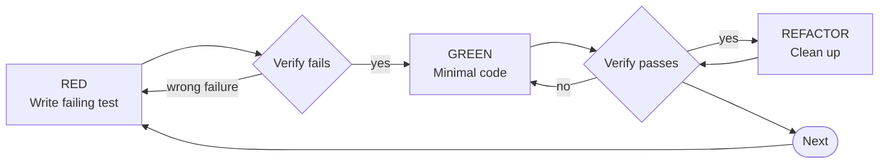

# Test-Driven Development (TDD) in Go

## Overview

Write the test first. Watch it fail. Write minimal code to pass.

**Core principle:** If you didn't watch the test fail, you don't know if it tests the right thing.

**Violating the letter of the rules is violating the spirit of the rules.**

## When to Use

**Always:**
- New features
- Bug fixes
- Refactoring
- Behaviour changes
- New exported functions
- Changes to concurrency logic

**Exceptions (ask your human partner):**
- Throwaway prototypes
- Generated code
- Pure configuration
- Temporary scripts

Thinking "skip TDD just this once"? Stop. That's rationalisation.

## Modes

Two modes of operation. The TDD cycle is identical in both (the difference is WHO writes the GREEN step).

**Autonomous** (default): Agent does everything. Tests, implementation, refactoring.

**Collaborative**: Agent writes tests and boilerplate, user implements. Agent reviews the result against the plan.

### Mode Selection

At the start of a TDD session, ask: **"Will you want to implement any of these yourself?"**

- **Yes** -> collaborative mode is active. Before each GREEN step, ask whether the user wants to implement this specific test.
- **No** -> autonomous mode. Proceed as normal.

Mode is fluid, not locked in:
- In autonomous mode, the user can interrupt at any point ("I want to do this one", "let me implement this") and the agent switches to collaborative for that test. After that test, return to autonomous unless told otherwise.
- In collaborative mode, the user can say "you do this one" and the agent handles that test autonomously.

### Mode Does Not Weaken TDD

Both modes follow the same cycle. The test is still written first, still verified to fail, still drives the implementation. Collaborative mode changes the hands on the keyboard, not the discipline.

## The Iron Law

```
NO PRODUCTION CODE WITHOUT A FAILING TEST FIRST
```

Write code before the test? Delete it. Start over.

**No exceptions:**
- Don't keep it as "reference"
- Don't "adapt" it while writing tests
- Don't look at it
- Delete means delete

Implement fresh from tests. Period.

## Red-Green-Refactor



## RED - Write Failing Test

Write one minimal test showing what should happen.

<Good>

```go
package retry

import (
	"errors"
	"testing"

	"github.com/stretchr/testify/assert"
	"github.com/stretchr/testify/require"
)

func TestRetry_SucceedsOnThirdAttempt(t *testing.T) {
	attempts := 0

	operation := func() (string, error) {
		attempts++
		if attempts < 3 {
			return "", errors.New("fail")
		}
		return "success", nil
	}

	result, err := Retry(operation)

	require.NoError(t, err)
	assert.Equal(t, "success", result)
	assert.Equal(t, 3, attempts)
}
```

Clear name. Tests real behaviour. One thing.

</Good>

<Bad>

```go
import "project/mocks"

func TestRetry(t *testing.T) {
  m := mocks.New()
  m.EXPECT().Retry().Return("success", nil)
	m.Retry()
}
```

Vague name. No assertions. Doesn't prove behaviour.

</Bad>

**Requirements:**
- One behaviour
- Clear name (`TestXxx_WhenYyy_ShouldZzz` is fine)
  - Tests should be grouped using `t.Run()` where they are testing different paths etc. for the same function
- Real logic, not fake confidence
- Mocks should be avoided unless simulating external services:
  - e.g. mocking a 400 API response to test the functions behaviour
  - attempting to simulate this response with a real service is reliant on the service not changing etc.

Prefer table-driven tests when validating variations:

```go
func TestIsValidEmail(t *testing.T) {
	tests := []struct {
		name   string
		input  string
		expect bool
	}{
		{name: "empty", input: "", expect: false},
		{name: "valid", input: "a@b.com", expect: true},
	}

	for _, test := range tests {
		t.Run(test.name, func(t *testing.T) {
			actual := IsValidEmail(test.input)
			assert.Equal(t, test.expect, actual)
		})
	}
}
```

## Verify RED - Watch It Fail

**MANDATORY. Never skip.**

```bash
go test ./retry -count=1 -run TestRetry_SucceedsOnThirdAttempt
```

Confirm:
- Test fails (not compile error unless function missing)
- Failure message is expected
- Not using a cached response
- Fails because behaviour not implemented

If the function doesn't exist yet (standalone TDD without scaffolding), you'll see something similar to:

```
ok  	./retry	0.003s [no tests to run]
```

_Note: that the test returned `ok`, ignore that, the important part is `[no tests to run]`._

Good. That's red.

If scaffolding exists from the implementation plan, the function already has a zero-value stub. The test will compile and fail on assertions — that is also red.

**Test passes?** You're testing existing behaviour. Fix test.

**Test errors for wrong reason?** Fix test until it fails correctly.

## GREEN - Minimal Code

Write the simplest code that makes the test pass.

<Good>

```go
package retry

func Retry(fn func() (string, error)) (string, error) {
	for i := 0; i < 3; i++ {
		result, err := fn()
		if err == nil {
			return result, nil
		}
		if i == 2 {
			return "", err
		}
	}
	return "", nil
}
```

Just enough to pass.

</Good>

<Bad>

```go
type RetryOptions struct {
	MaxRetries int
	Backoff    func(int)
	Logger     interface{}
	TimeoutMs  int
}
```

YAGNI. Not required by test.

</Bad>

Don't:
- Add configurability
- Generalise prematurely
- Add logging
- Improve unrelated code

Pass the test. Nothing more.

## Verify GREEN - Watch It Pass

**MANDATORY.**

```bash
go test ./path/to/name -count=1 -run Test_Name
```

Confirm:
- Test passes
- All other tests pass
- No race conditions (use `-race` when relevant)

**Test fails?** Fix code, not test.

**Other tests fail?** Fix immediately.

## REFACTOR - Clean Up

```
THE ASSESSMENT IS NOT OPTIONAL. THE REFACTORING MIGHT BE.
```

After every GREEN, stop and assess the code. The problem is not failing to refactor — sometimes there is nothing to refactor. The problem is failing to *look*.

**The process:**

1. **Pause and read the implementation so far.** Look at the code with fresh eyes — not just the function you just changed, but its surroundings. Each GREEN step adds code; the accumulation may need tidying.
2. **Assess whether refactoring is needed.** Consider:
   - Can names be improved?
   - Is there duplication that should be extracted?
   - Can control flow be simplified?
   - Is error handling clear?
   - Are helpers needed?
   - Does the code read well top-to-bottom?
   - Does it follow the project conventions (CLAUDE.md)?
   - Does it follow the patterns and conventions in the plan's Technical Decisions section? (when working from an implementation plan)
3. **If refactoring is needed, do it.** One change at a time, verifying tests pass after each change.
4. **If no refactoring is needed, move on.** A brief note is fine — "nothing to tidy, the implementation is a single conditional." Do not force changes for the sake of having a refactoring step.

**Run formatters and linters after each GREEN-REFACTOR cycle:**

```bash
go fmt ./...
golangci-lint run ./... --fix
```

Keep tests green at every step. Do not add new behaviour during refactor.

**Common signs the assessment was skipped entirely:**
- Multiple GREEN steps have accumulated without the code ever being reconsidered
- Variable names are still the first thing that came to mind
- The same pattern is copy-pasted across test cases
- The function has grown but its structure has not been looked at
- Linter warnings have accumulated

The assessment is what matters. Sometimes it leads to refactoring, sometimes it confirms the code is already clean. Both are valid outcomes. Silently moving to the next test without looking is not.

## Repeat

Next failing test for next feature.

## Good Tests

| Quality | Good | Bad |
|---------|------|-----|
| **Minimal** | One thing. "and" in name? Split it. | `TestValidatesEmailAndDomainAndWhitespace` |
| **Clear** | Name describes behaviour | `TestThing` |
| **Shows intent** | Demonstrates desired API | Obscures what code should do |

## Go-Specific Guidance

### Test Exported Behaviour

Test through exported functions when possible.

Avoid testing:
- Private helpers directly
- Internal struct fields
- Implementation details

Test behaviour, not structure.

### Avoid Over-Mocking

In Go:
- Prefer real implementations
- Use interfaces for decoupling
- Inject dependencies via function parameters or struct fields

If you must mock:
- Define small interfaces
- Avoid large "god interfaces"

Hard to test? Design is wrong.

### Concurrency Requires Tests First

Before writing goroutines:
- Write test that proves behaviour
- Use channels deterministically
- Use timeouts carefully

If concurrency test is flaky, your design is unclear.

When testing concurrent code, run the tests multiple times using `-count=10` to catch flaky tests.

For testing asynchronous and time-dependent code, read @testing-time.md (it covers `testing/synctest`, available since Go 1.25) which eliminates flaky sleeps and polling loops in concurrent tests.

## Collaborative Mode

This section defines the per-test flow when the user is implementing. It extends the standard RED-GREEN-REFACTOR cycle, it does not replace it.

### Per-Test Flow

#### RED (agent)

1. Agent writes the failing test
2. Agent verifies it fails (**mandatory**, same as autonomous)

#### Handover

3. Agent asks: **"Do you want to implement this, or shall I?"**
4. If user wants to implement, agent creates a **compilable stub**: the function signature with zero-value returns. Just enough to compile and anchor a diagnostic. The stub will fail the test (zero values won't satisfy assertions), so TDD integrity is preserved.
5. Agent places a single `blocker` on the stub:
   - `message`: what needs implementing
   - `breakdown`: requirements, acceptance criteria, and edge cases derived from the test
   - `subject`: group diagnostics by test name so they can be dismissed together later
   - Do not prescribe an implementation approach. State what the code must do, not how.
6. Agent waits for the user to signal they're done (natural language: "done", "ready", "run the tests", etc.)

#### GREEN Verification (agent)

7. Agent runs the tests
8. If tests fail: agent provides feedback via chat, user continues implementing
9. If tests pass: agent moves to review

#### Review (agent, collaborative only)

After the user's implementation passes, the agent reviews it against the test plan. This is NOT a general code review (it is specifically checking TDD discipline and plan alignment).

Check for:
- **Over-engineering**: code beyond what the current test required -> `refactor_suggestion` to simplify
- **Plan conflicts**: design choices that will conflict with upcoming tests in the plan -> `blocker` flagging the conflict
- **Premature refactoring**: user mixed GREEN and REFACTOR steps -> `note` suggesting to separate concerns

Provide a chat summary of the review alongside the nudge diagnostics.

If the review is clean, say so briefly and move on. Do not invent issues.

#### REFACTOR (agent-guided)

10. Agent suggests refactoring via `refactor_suggestion` diagnostics
11. User or agent performs the refactoring (user's choice)
12. Agent verifies tests still pass

#### Cleanup

13. Agent dismisses all nudge diagnostics for the completed test (by `subject`)
14. Move to next test in the plan

### Test Manifest

This section applies when TDD follows the implementation plan pipeline. For standalone use (bug fixes, small changes, or features without a plan), the same RED-GREEN-REFACTOR cycle applies — write one failing test at a time, work from simple to complex. There is no manifest to track, but the discipline is identical.

#### Reading the Plan

When a test manifest exists, the implementation plan document (`YYYY-MM-DD-<topic>-plan.md` in the project root) is your reference. Read it at the start of every TDD session. It contains:

- **Technical Decisions**: architectural patterns, DI approach, library choices, and conventions agreed during planning. Each decision is marked as a **structural constraint** (must follow) or **stylistic preference** (follow unless TDD reveals a better approach). These decisions guide how you write implementations — not just what behaviour to produce, but how to structure the code. Check this section before writing your first GREEN step.
- **Scaffolding**: the public API created before TDD — interfaces, exported types, function signatures, file structure. This is the design materialised in code. The contract that tests exercise from the caller's perspective.
- **Test Manifest**: the ordered list of behaviours to test, grouped into implementation chunks.
- **Progress**: what has been completed so far. If this is not the first session, start here to know where to pick up.
- **Notes**: anything discovered during planning that you need to know.

The brainstorming document (referenced at the top of the plan) provides additional context — the design intent, constraints, and out of scope items. Read it if you need to understand *why* a decision was made.

#### Scaffolding

The scaffolding is created by the implementation plan skill before TDD starts. It defines the structural contract.

**Do not change the scaffolding without updating the plan.** If a test reveals that an interface needs a different method, a type needs a different field, or a function signature is wrong, that is a plan deviation. Raise it with the user, update the plan, then make the change. The scaffolding is the reference point for the review step — deviations from it are how plan conflicts are detected.

#### Chunks and Commits

The test manifest is grouped into **implementation chunks**. Each chunk is a coherent unit of work — typically aligned with a package or component boundary — designed to be completed, reviewed, and committed independently.

**Work through one chunk at a time.** Within each chunk, work through entries in order using RED-GREEN-REFACTOR.

**Commit after completing each chunk.** Each chunk produces one commit. This is not optional — the commit boundaries exist so that the resulting PR has reviewable, coherent commits rather than one monolithic change. A human with a finite attention span will review each commit. Respect that.

**Cold-starting a chunk.** If a session ends mid-work or context fills up, a fresh session can pick up from any chunk. Read the plan document — Technical Decisions tells you how to build, Scaffolding tells you what exists, Progress tells you what is done, and the current chunk's entries tell you what to do next. The plan must be detailed enough for this to work without any context from prior sessions.

**When a chunk runs larger than expected.** Use judgement. If you are mid-chunk and the implementation is growing beyond what is comfortably reviewable, finish the current test's RED-GREEN-REFACTOR cycle, commit what is done, update Progress to note the partial completion, and continue in the next session or with a fresh context. Do not leave a half-finished test cycle uncommitted.

#### Working Through Entries

**The manifest is a minimum bound.** Every entry must go through RED-GREEN-REFACTOR. The agent works through the manifest in order, both in autonomous and collaborative mode.

**Tracking progress:** After each completed RED-GREEN-REFACTOR cycle, update the Progress section of the implementation plan document. Record:
- Which entry was completed
- Whether the test was added as written in the manifest or modified (and why)
- Any additional tests discovered during implementation (add these to the manifest within the appropriate chunk as well)

This is how the next session knows where to pick up. Do not defer this — update after each cycle, not in batches.

**Adding tests:** If TDD surfaces edge cases or behaviours not in the manifest, add them. Update the implementation plan document with the new entries in the manifest (within the appropriate chunk) and a note in the progress section that they were discovered during implementation.

**Skipping or removing entries:** Not permitted without the user's explicit approval. If a manifest entry does not make sense or is not possible, raise it with the user — explain why, and wait for a decision. Do not silently skip it.

**Checking against the manifest:** During the review step (collaborative mode) or after each GREEN-REFACTOR cycle (autonomous mode), check the current implementation against upcoming manifest entries. If the current approach will conflict with a later entry, flag it now rather than discovering it later.

**Out of scope:** The brainstorming document's out of scope section applies here. If a test or implementation direction touches something explicitly excluded, stop and check with the user. This does not mean out of scope items can never be done — it means they require the user's explicit approval and the brainstorming document must be updated first. The process exists for a reason; follow it rather than making scope decisions unilaterally.

**Completion:** The feature is not done until every manifest entry in every chunk has a passing test and the verification checklist passes. No exceptions.

**Integration / wiring:** The test manifest includes entries that verify the feature is wired into the application. These are not optional. A feature that works in isolation but is not reachable through the normal application entry point is incomplete. If the wiring tests are missing from the manifest, raise it with the user — do not silently skip integration.

**Design flaws:** If TDD reveals a fundamental design issue — not a scaffolding tweak, but a flaw in the approach itself (a missing abstraction, conflicting requirements, an assumption that does not hold) — stop and tell the user. This may need the brainstorming skill to be re-invoked to address the gap before TDD can continue. Do not attempt to work around a design flaw by bending the implementation.

## Why Order Matters

**"I'll write tests after to verify it works"**

Tests written after code pass immediately. Passing immediately proves nothing:
- Might test wrong thing
- Might test implementation, not behaviour
- Might miss edge cases you forgot
- You never saw it catch the bug

Test-first forces you to see the test fail, proving it actually tests something.

**"I already manually tested all the edge cases"**

Manual testing is ad-hoc. You think you tested everything but:
- No record of what you tested
- Can't re-run when code changes
- Easy to forget cases under pressure
- "It worked when I tried it" ≠ comprehensive

Automated tests are systematic. They run the same way every time.

**"Deleting X hours of work is wasteful"**

Sunk cost fallacy. The time is already gone. Your choice now:
- Delete and rewrite with TDD (X more hours, high confidence)
- Keep it and add tests after (30 min, low confidence, likely bugs)

The "waste" is keeping code you can't trust. Working code without real tests is technical debt.

**"TDD is dogmatic, being pragmatic means adapting"**

TDD IS pragmatic:
- Finds bugs before commit (faster than debugging after)
- Prevents regressions (tests catch breaks immediately)
- Documents behaviour (tests show how to use code)
- Enables refactoring (change freely, tests catch breaks)

"Pragmatic" shortcuts = debugging in production = slower.

**"Tests after achieve the same goals - it's spirit not ritual"**

No. Tests-after answer "What does this do?" Tests-first answer "What should this do?"

Tests-after are biased by your implementation. You test what you built, not what's required. You verify remembered edge cases, not discovered ones.

Tests-first force edge case discovery before implementing. Tests-after verify you remembered everything (you didn't).

30 minutes of tests after != TDD. You get coverage, lose proof tests work.

## Common Rationalisations

| Excuse | Reality |
|--------|---------|
| "Too simple to test" | Simple code breaks. Test takes 30 seconds. |
| "I'll test after" | Tests passing immediately prove nothing. |
| "Tests after achieve same goals" | Tests-after = "what does this do?" Tests-first = "what should this do?" |
| "Already manually tested" | Ad-hoc ≠ systematic. No record, can't re-run. |
| "Deleting X hours is wasteful" | Sunk cost fallacy. Keeping unverified code is technical debt. |
| "Keep as reference, write tests first" | You'll adapt it. That's testing after. Delete means delete. |
| "Need to explore first" | Fine. Throw away exploration, start with TDD. |
| "Test hard = design unclear" | Listen to test. Hard to test = hard to use. |
| "TDD will slow me down" | TDD faster than debugging. Pragmatic = test-first. |
| "Manual test faster" | Manual doesn't prove edge cases. You'll re-test every change. |
| "Existing code has no tests" | You're improving it. Add tests for existing code. |
| "Go is simple, I don't need TDD" | Simplicity makes TDD easier, not unnecessary. |
| "Compiler will catch errors" | Compiler checks types, not behaviour. |

## Red Flags - STOP and Start Over

- Code before test
- Test after implementation
- Test passes immediately
- Can't explain why test failed
- Tests added "later"
- Rationalising "just this once"
- "I already manually tested it"
- "Tests after achieve the same purpose"
- "It's about spirit not ritual"
- "Keep as reference" or "adapt existing code"
- "Already spent X hours, deleting is wasteful"
- "TDD is dogmatic, I'm being pragmatic"
- "This is different because..."

**All of these mean: Delete code. Start again with TDD.**

## Example: Bug Fix

**Bug:** Empty email accepted

**RED**
```go
func TestSubmitForm_RejectsEmptyEmail(t *testing.T) {
	result, err := SubmitForm(FormData{Email: ""})
	require.NoError(t, err)
	assert.Equal(t, "Email required", result.Error)
}
```

**Verify RED**
```bash
$ go test ./... -count=1 -run TestSubmitForm_RejectsEmptyEmail
FAIL: expected "Email required", got ""
```

**GREEN**
```go
func SubmitForm(data FormData) (result Result, err error) {
	if strings.TrimSpace(data.Email) == "" {
		result.Error = "Email required"
		return
	}
	// ...
	return
}
```

**Verify GREEN**
```bash
$ go test ./... -count=1 -run TestSubmitForm_RejectsEmptyEmail
PASS
```

**REFACTOR**
Extract validation for multiple fields if needed.

## Verification Checklist

Before marking work complete:

- [ ] Every test manifest entry has a passing test
- [ ] Every new exported function has a test
- [ ] Watched each test fail before implementing
- [ ] Each test failed for expected reason (feature missing, not typo)
- [ ] Wrote minimal code to pass each test
- [ ] Assessed the code after every GREEN step (refactored where needed, moved on where not)
- [ ] All tests pass
- [ ] `go test ./... -race` passes
- [ ] `go vet ./...` clean
- [ ] `golangci-lint run ./... -fix` clean
- [ ] Output pristine (no errors, warnings)
- [ ] Tests use real behaviour (mocks only if unavoidable)
- [ ] Edge cases and errors covered
- [ ] Concurrent tests run with `-count=10`
- [ ] If the manifest includes wiring tests: feature is wired into the application, not just passing in isolation
- [ ] Implementation follows the patterns in the plan's Technical Decisions section (when working from a plan)
- [ ] No out of scope items were implemented

Can't check all boxes? You skipped TDD. Start over.

### Evidence Before Claims

**Every checklist item must be verified by running the command and reading the output.** Do not claim a box is checked based on memory, assumption, or confidence.

- "Should pass" is not evidence. Run the command.
- "I'm confident" is not evidence. Run the command.
- A previous run is not evidence. Run it again.
- Partial verification proves nothing. Run the full check.

If you are about to write "done", "complete", "all tests pass", or any variation — stop. Have you run every verification command in this checklist and read the output? If not, you are guessing, not verifying.

If you catch yourself rationalising why a check can be skipped, re-read the [Common Rationalisations](#common-rationalisations) table. The same instinct that says "I'll test after" says "I'm sure it passes." Both are wrong for the same reason.

## When Stuck

| Problem | Solution |
|---------|----------|
| Don't know how to test | Write wished-for API. Write assertion first. Ask your human partner. |
| Test too complicated | Design too complicated. Simplify interface. |
| Must mock everything | Code too coupled. Use dependency injection. |
| Test setup huge | Extract helpers. Still complex? Simplify design. |

## Debugging Integration

Bug found? Write failing test reproducing it. Follow TDD cycle. Test proves fix and prevents regression.

Never fix bugs without a test.

## Testing Anti-Patterns

When adding mocks or test utilities, read @testing-anti-patterns.md to avoid common pitfalls:
- Testing mock behaviour instead of real behaviour
- Adding test-only methods to production types
- Mocking without understanding dependencies

## Final Rule

```
Production code -> test exists and failed first
Otherwise -> not TDD
```

No exceptions without your human partner's permission.
